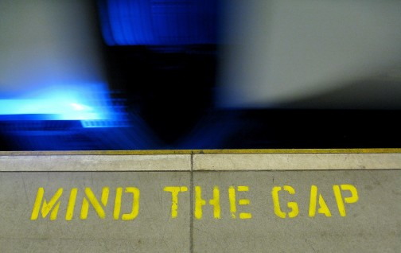

# Beautiful Budgets: Gaps & Opportunities in Online Budget Engagement
### Eric Jackson

It is budget season in Asheville. The [2017-18 proposed budget](http://www.ashevillenc.gov/civicax/filebank/blobdload.aspx?blobid=27587) is being presented today to City Council, and the City’s first official [online budget dashboard](http://dashboards.ashevillenc.gov/BUDGET?entity=city&id=&label=City+of+Asheville&view=summary)  launched today as well. The following post is adapted from one I published last year (before I joined the City of Asheville staff) on the University of North Carolina School of Government [Community Engagement Learning Exchange](https://cele.sog.unc.edu/beautiful-budgets-opportunities-and-gaps-in-online-local-budget-engagement/).

Over the last few years, there has been a mini-explosion of websites that use visualization and interactivity to make government budgets easier to understand and navigate. Efforts have ranged from volunteer-led open source projects like [Open Budget: Oakland](http://openbudgetoakland.org/) or the Asheville budget sites I created through Code for Asheville to government-led efforts  like [Asheville’s current budget dashboard](http://dashboards.ashevillenc.gov/BUDGET?entity=city&id=&label=City+of+Asheville&view=summary), Chattanooga’s [Open Budget App](http://budget.chattanooga.gov/#!/year/default) or [Ohio’s Open Checkbook](http://ohiotreasurer.gov/Transparency/Ohios-Online-Checkbook). Cloud services for open budgets have been launched by commercial ventures like [OpenGov](http://opengov.com/) and [Balancing Act](http://abalancingact.com/). There has also been significant legislative activity, including the Data Act at the federal level and a new [North Carolina requirement](http://www.ncleg.net/Sessions/2015/Bills/House/HTML/H97v9.html) (section 7.17) that local governments publish budget and spending data to a central state transparency website.

All these initiatives are very much to be celebrated. They are the leading edge of a powerful and growing trend toward greater openness in local government and promise better citizen access to the critical financial information and decision-making that underlie nearly everything city and county governments do. However, it’s important to ask just where we’re going and how we’ll know that we’ve arrived. How do we ensure that open budget efforts actually improve community engagement and outcomes over other means for learning citizens’ priorities?

Let’s begin by examining just what a public budget is and what makes it good or bad.

A public budget encodes a community’s decisions about how to allocate scarce shared resources in order to meet its needs and to accomplish its goals. The budget must of course meet basic legal requirements and responsible fiscal standards. Beyond that, though, there are two key dimensions of public budget quality: legitimacy and effectiveness. A budget is legitimate if it is and is seen to be an accurate reflection of the values and priorities of the whole community. A budget is effective if it can reasonably be expected to accomplish the outcomes the community desires.

So where, then, do open budgets come in?

If we consider ‘open budget’ to mean nothing more than making budget data easier to access or simply making it more understandable to more people, then the connection between ‘open’ budgets and ‘good’ budgets seems to me tenuous at best. Opening the data is only a means to an end and, while transparency can limit illegitimacy and ineffectiveness, it does little to directly promote it. If we want open budgets to play a significant role in improving public budgeting, then I believe we need to consider a much more expansive definition. Here is mine:

An open budget

1. is one created through a process which encourages and enables participation by all stakeholders to ensure that it reflects the values and priorities of the whole community, and
1. makes clear the connection between allocated resources and expected outcomes in order to support robust discussion and testing of expected vs. actual impact.

That definition makes it quite obvious that we have a long way to go. Here are a four specific gaps I see.

* Open budgets activity is sparse: According to the 2012 Census of Governments, there are 89,000 local government budgeting entities in the United States, not counting public institutions of higher learning. Against this backdrop, the open budgets movement has just barely begun. Further, most of the activity is concentrated in larger, wealthier municipalities, leading to a kind of digital divide in access to improved budget transparency and open process.
* Open budgets are rarely designed to engage new kinds of stakeholders: Budget sites rarely differentiate either presentation or delivery channels to improve their ability to reach groups that have been historically under-represented. While interactive visualizations can make it easier to understand public financial data, they are not game-changers for reaching new stakeholders.
* Open budgets are currently about presentation rather than process: Through visualizations and interactivity, open budget efforts make it easier to grasp budget data that is published during the budget-making process, but they rarely connect in any meaningful way to the process itself. As defined above, open budgets necessarily involve much more than machine-readable data and nice visualizations. There must be observable ways to see better community outreach and inclusion.
* Open budgets rarely connect allocations to outcomes: At best, open budget efforts to date have done little more than link spending categories to revenue sources. Typically they do a poor job of telling citizens what spending is supposed to accomplish. To be fair, this is primarily a function of how budgets are presented and decided by the governments themselves, but it is an area of opportunity that has not so far been exploited.

In my next post I’ll reflect a bit on how we might begin to bridge these gaps.

In the meantime, I would love your comments. What have I got right or wrong about where we need to go? Are there other gaps that I haven’t identified?

Photo Credit: The image above is [mind the gap](https://www.flickr.com/photos/limaoscarjuliet/3305886294/) by Pawel Loj.

Originally published May 9, 2017

Tags: CIVIC IT, DASHBOARDS, DIGITAL GOVERNMENT, OPEN DATA
