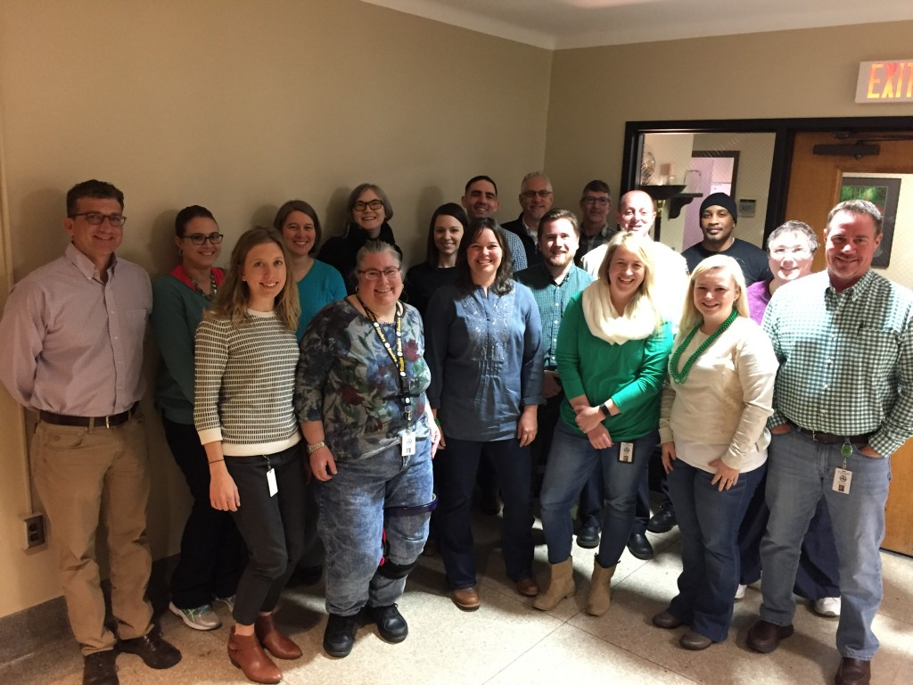

# Power to the People: Easing Change Through End-User Guides
### By Holly Barham

Getting almost 1200 employees who have been using Microsoft Office to switch to Google is no easy task. Sure, there are some technical considerations, but the biggest challenge is working with people to help them understand that not only is the office software they’ve been using most of their lives about to become a thing of the past, but that this is a good thing!

We gave ourselves a lengthy timeframe to achieve the transition, mainly to give everyone the opportunity to adjust to both the idea of change and the new tool set. We knew the most important aspect of the project was going to be the people.

We knew we had 300+ computers needing Office 2007 removed by October 1, 2017, so we gave all employees both Microsoft and Google in December 2016. To prepare everyone for the switch, in January we began offering regularly scheduled trainings, and we also implemented a Google Guides program: that is, we strategically selected someone from each department within the City to serve as an advocate and support person for their peers. (Full disclosure, it wasn’t our idea, but when we read about it in Google’s transition guide, we all fell in love with it.) As an incentive to participate, we provided Chromebooks for Google Guides, and took a train the trainer approach.

The Google Guides have been one of the most successful parts of the project.  While the guides have been champions for the transition, and a great resource for their colleagues, the true pleasure has been meeting with them and hearing their stories. It’s been pretty rewarding to see folks genuinely excited about new tools and collaboration.

As cheesy as it sounds, I love to hear how they’ve made new connections with teammates. The guides often share how rewarding it is to show a neighbor a tool that saves time or makes their job a little easier, or even to just see the light bulb go off when they learn something new. Many of them have thanked me for the experience. It’s a solid reminder that technology is about people. All the tools in the world won’t solve problems if we don’t have good people putting them to good use. And unless you empower people with the knowledge they need to use the tools, they don’t do anyone any good. And one of the best ways to do that? Empower people to do the empowering!

Originally published March 28, 2017

Tags: CHANGE MANAGEMENT, CIVIC IT, COLLABORATION, DIGITAL GOVERNMENT, DIGITAL TRANSFORMATION
