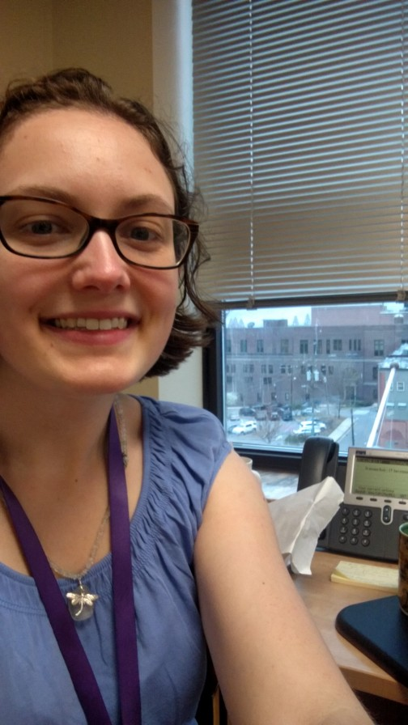

# A Civic Tech Employee’s First Weeks: the Welcome, the Workload, and What Needs Improvement
### By Frances Ruiz

* We recently conducted an exit interview with Cameron Carlyle to learn what we could from him about his experience and ways to improve IT Services. We realized that it’s just as valuable to learn from someone just starting while they still have new eyes. In that spirit, the second of two “entrance interviews” with Frances Ruiz, Cameron’s replacement. [The first is here](./tech-skills-assessments.md). – The Editors *

## How was the welcome?

The welcome has been great! I immediately felt well integrated into the team. It was also wonderful to have a two-week overlap with my predecessor, which ensured a smooth transition and enabled me to receive training from the person who I would be replacing.

## How is the supervision?

So far I have been given a lot of freedom to explore and complete tasks in my own way, but I can always get support whenever I have questions or wish to bounce ideas off of a co-worker or my manager. There is a collaborative environment in the department and a general lack of rigidity, which allows for a lot of innovation and the exploration of new ideas. With so much freedom comes a potential danger of spending all day dreaming up new cool things as opposed to getting serious about implementing them, but I am used to self-organizing and setting goals and working to achieve them methodically, so a lack of externally applied structure is not so far posing an issue. I impose my own structure by enumerating the tasks to be done, and then tackling them one by one.

## How is the workload?

The work is very interesting and I feel good to be a part of helping my hometown of Asheville! As I’m sure is the case for most cities, there is no shortage of work to do, but I would much rather be super busy than twiddling my thumbs trying to figure out what to do with myself. For now management is shielding me as much as possible from taking on too many new projects or being pulled away for too many emergencies since my highest priority task at the moment is to redesign and enhance SimpliCity with new features. There is quite a lot to be done on SimpliCity and we have a very ambitious development timeline, so that alone is more than enough to keep me busy for the next several months.

## What do you like best about your job? What projects are you most excited about the future?

I love creating new applications for the web and for mobile. The creative process and making an idea become a reality is what I thrive on. I am excited to keep working on SimpliCity’s expansion to provide more topic dashboards and a My SimpliCity extension where users will be able to create accounts to save their favorite dashboards. After the SimpliCity redesign is complete I do not know exactly what will be on the horizon, but there has been recent talk about creating a variety of mobile apps to help citizens, as well as continuing to explore new web applications that could enhance our services and transparency to the community.

## As a new team member, what do you think is the biggest challenge or area for improvement?

I’ve been struck by how many demands there are on IT, both from other departments within the city and from the community. While in a perfect world we would be able to make everyone’s wish list become a reality, we simply do not have enough resources to achieve everything that everybody wants. We must therefore prioritize and manage resources in the best possible way.

I have been impressed with the team’s self-awareness and introspection on how we can improve our prioritization processes, and I’m happy to be a part of discussions to discover ways we can improve our expectation management and resource management. How we can best manage expectations of other departments and the public? How can we effectively communicate about why certain requests are or aren’t feasible/realistic? How can we make accurate time estimates for projects? How can we see if our resources and team members’ skills are being used effectively?

On a micro scale, I feel like it is essential for me and my supervisor to know where my efforts are going and what tasks I am spending my time on. For my own work I have been tracking how my time is being divided using Toggl, with different tasks and categories for everything I do. My manager can go in at any time and see how much I’ve worked on each different task during the week. Each week I get a summary time report emailed to me which I forward to my supervisor. As a result we can monitor if my time is being spent in the way that best benefits the IT services goals.

I have also set up an agile project for SimpliCity in JIRA to track what remains to be done for the first release and my progress on each goal. That way I can put in estimates for each task and see a burndown chart of my progress. Then it is very clear exactly where we are in the development process and how we are doing with respect to meeting the target goal dates.

## Any final thoughts?

I am very happy to be part of City of Asheville’s IT Services!

Originally published April 11, 2017

Tags: CIVIC IT, HIRING, IT SERVICES
