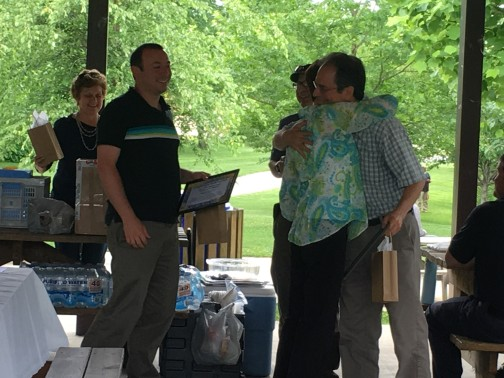

# Extending Gratitude Beyond Our Walls: External Partnerships That Matter
### By Scott Barnwell

The IT Services team here in Asheville loves celebrating people, both on our own team and in other departments. We try to do it all the time, but each summer at our annual picnic we have formal recognition ceremony for everyone who has helped IT be successful in our work. These peer-nominated awards are the highlight of the annual celebration and give us a way to publicly recognize the best work of our colleagues throughout the City.

This year something different happened. For the first time, there were multiple nominations for partners outside the City of Asheville organizations. This was neither planned nor requested when we solicited nominations and it had never happened before. Nonetheless, multiple IT Services staff nominated six external partners for awards.

The fact is, much of our success depends not only on strong partnerships with colleagues inside the City but also with external agencies, vendors, and community members. These people make it possible for us to take on bigger and more meaningful challenges in the community and to deliver better services to our citizens. This has always been true of government, but digital transformation has made it even more important.

Now, without further ado, the 2017 City of Asheville “IT Services Team Player” awards for our external partners:

* Brian Houze and Catherine Reed, Buncombe County Government: Brian and Catherine were instrumental in a joint City of Asheville / Buncombe County project to improve fire hydrant mapping data. They worked to automate hydrant updates so that firefighters responding to emergencies will have direct access from their smartphones to the most current information regarding hydrant locations and water pressure.
Don Davis, Skyrunner: Don worked closely with city staff to successfully troubleshoot ongoing and intermittent response time problems between the city’s Health Services clinic and an online health records management system.
* Patrick Conant, PRC Applications and Code for Asheville: Patrick is a power user of city data and has led a number of volunteer civic technology projects to improve our community. His data work spans the use of crime data to create monthly reports for the East-West Neighborhood association, parking data to create AVLPark.com and more recent collaborations on homeless arrests and traffic stops to spark conversations about policing in Asheville.
* Steve Brooks, Brooks Network Solutions: Steve has been an incredible resource in supporting wireless Internet access at the US Cellular Center and for providing timely assistance during the biggest events held at that facility, such as the Southern Conference basketball tournament.
* Steve Robison, Communication Service Inc.: Steve has been a long time vendor and partner with the City of Asheville. Most recently, he provided outstanding service and expertise during a major upgrade from analog to digital public safety radio service.

Originally published July 13, 2017
Tags: COLLABORATION, CULTURE, DIGITAL TRANSFORMATION

