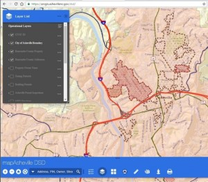

# Letting Our Customers Teach Us What Simple Means
### By Christen McNamara

I had a chance recently to watch building permit facilitators use GIS and a mapping application we developed for our work. I walked away with a completely different perspective on the problem and a goal of field trips to other departments. The most striking thing: almost every fix they needed was a way to make the application simpler.

## Field Trip Friday
Recently, I spent a Friday morning in our Permits Office in Development Services (DSD) watching the permit facilitators use GIS in their jobs.  The management had invited us because they felt that GIS wasn’t really working for what they needed.  Leave the office? Didn’t have to ask me twice. Eric Jackson, our Digital Services Architect volunteered to tag along and off we went!

We showed up eager to see another department and when we arrived their manager, Russell, showed us around and explained what everyone did, then had us meet with the permit facilitators one-by-one.  As we met with each facilitator they told us how much they missed the old version of _mapAsheville_*, and showed us why and how they used our GIS applications in their jobs, as well as what didn’t work for them.

## Simple is better
Right away we realized that the map viewer we had built was too complex. There were too many layers that took too long to load and got in the way of them doing their work. In some cases, it wasn’t clear how to get all the information they needed, so a facilitator might have 2-3 GIS applications open, referring to different ones for different questions.  Sometimes they simply didn’t know that a tool was available.  And there were some truly embarrassing errors, such as the Aerial Imagery overlaying the Flood Zone data, making it impossible to see the Flood Zones. Overall, the tools were way too complex and poorly communicated and that was a problem.

## “Build with, not for”
It’s eye-opening to see your solution not be the right solution. This was a great example of how one size doesn’t fit all, and giving everything to everyone made for just too much.   As a quick fix, we built a DSD map viewer with just the information they asked us for, labeled the way they needed and using the original symbology that they were accustomed to.  We launched it that afternoon, and asked for feedback on how it was working. In the process I learned a tremendous lesson:  building mapping applications in my City Hall office isn’t going to work.  I need to visit the users, let them tell me what they need the applications to do, and then work together with them to build it.  

*The old version of _mapAsheville_ was an award-winning Map Viewer that we lost in a hardware crash in February 2016, RIP _mapAsheville_.

Originally published September 22, 2016.

Tags: GIS, Lean Government, User-Centered Design
