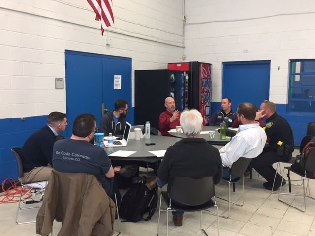
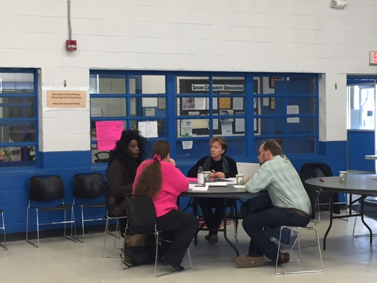
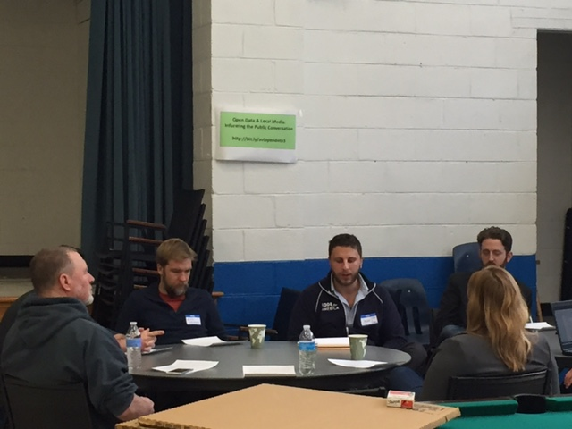

# Open Data Day 2017
### By Eric Jackson

About 25 people showed up Asheville’s Open Data Day on March 4, enjoying good food and lively conversation about the important challenges of making open data actually matter for our community.

## Introductory Remarks

Vice Mayor Gwen Wisler kicked off the event with the not-entirely-shocking revelation that she was a computer science major back in the day. In her remarks she talked about the ways open data actually makes government more effective. She also emphasized that making data really useful requires a clear understanding of what questions you are trying to answer.

Next Asheville CIO Jonathan Feldman emphasized the City’s commitment to open government and data, explaining the City Council Open Data Policy and some of the basic concepts around open data. He also talked about digital disruption and the four pillars of digital transformation: automation, self-service, a focus on customers (or, in this case, citizens), and use of real-time data in service of greater agility. The end result: a shift from top-down, command-and-control systems to “networks of influence” and collaboration.

During the remainder of the day participants split into three workgroups to grapple with the challenge of realizing the promise of open data. In addition, City GIS Programmer Analyst Christen McNamara tended an Open Data Demo bar, where City open data platforms such as [Map Asheville](https://cityofasheville.github.io/maps//), [Simplicity](https://simplicity.ashevillenc.gov), the [Open Data portal](http://data.ashevillenc.gov/), and the [Public Records Request portal](https://asheville.seamlessdocs.com/f/HqoFi3) could be viewed and tested. The Open Data bar also gave a space to show off citizen applications that use open data such as [AVLPark.com](http://avlpark.com/) and [SunshineRequest.com](https://sunshinerequest.com/).

## Working Groups

Under the general rubric of “we have no idea what we’re doing, but neither does anyone else, so let’s work together to figure it out,” we broke up into three working groups, each approaching open data from a different perspective. Below are a few key takeaways from each of those conversations together with links to the actual notes taken during the sessions. Both Code for Asheville and the City of Asheville open data team will be processing the results in order to identify some concrete steps forward – expect to hear more in the future!

### Open Data & Community Groups: Promoting Community Engagement

* Relationships lie at the heart of effective engagement: Open data evangelist [Jason Hare](https://www.linkedin.com/in/jhare/) provided the punchline for this one with a quote from a former USDA open data program manager: “5% of my job is technology and 95% is building trust with data stakeholders”. There is a need to establish relationships with stakeholders first, before a crisis occurs. There are lots of channels available to do this, including faith leaders, community groups, journalists and others.
* Data needs context: Understanding what conclusions can be drawn from data usually requires knowing more about its context than is readily obvious from the data itself. How it was collected, why certain information is or isn’t included, or simply who to contact with questions are all vital information that must be provided along with the data.
* Equity doesn’t happen automatically: As government moves to release data to the public, decisions have to be made regarding which datasets to prioritize for release. As a result, the data in open data portals can reflect inequity and power imbalances in a community. It’s important to be very deliberate to release and use open data in a manner that is inclusive and representative of the overall community, as well as to find ways to provide access to people who may not have access to or know how to use digital tools.

[Notes from the Open Data & Community Groups session](https://docs.google.com/document/d/1IzvjfeflXi842-9YipjMktUMskYeF0iAxaoke7GQLoc/edit)

### Open Data & Policy-Making: Influencing the Policy Process

* Metrics before implementation: Performance metrics and standards should be used to show the effectiveness of policies, to refine and improve them, and to hold people and organizations accountable. It’s important to identify metrics to be used before policy implementation, which means we also need to define specific goals and desired outcomes well in advance.
* Improve & track communication: There is a need for improved communications from the City of Asheville together with good tracking of communication metrics to guide that effort. This should include tracking of numbers and demographics of participation and public input at public meetings.
* Improve access to information: We need to make it easier for more people to access City government information. This could include focusing outreach by letting citizens opt-in to communications on specific topics of interest rather than forcing them to search for information over and over. For people who lack easy access to online information, consider initiatives like offering public wifi at the ART bus station and/or on buses.

[Notes from the Open Data & Policy-Making session](https://docs.google.com/document/d/1IzvjfeflXi842-9YipjMktUMskYeF0iAxaoke7GQLoc/edit)

### Open Data & Local Media: Informing the Public Conversation

* More self-service data for reporting: Journalists often need public information quickly to ensure that they can complete a story on time with accurate information. Many times, journalists do not have the time to make a formal request for data and wait for it to be fulfilled. Moving forward, we should explore implementing city platforms that are built to allow journalists and the public do their own reporting.
* Allow queueing of requests for not-yet-released data: It would be helpful to have a system or process for requesting data that is forthcoming and hasn’t been released yet. Current policy is to not fulfill public data requests before reports are officially released, however there is no way to queue up a request for when the data is released.
* Improve committee meeting records: Important committee meetings are challenging to report on due to frequently incomplete agendas and minutes or records that are not always published in a timely manner. The City should explore a program to have every single committee meeting video recorded, and should ensure that the agendas are complete and published in a timely manner, minutes are as detailed as possible, and all information is organized and searchable/filterable.

[Notes from the Open Data & Local Media session](https://docs.google.com/document/d/1ct18Gp7a5adGAnFrQ5jcfyyjfGjZzsLdU9KwsY7mLHk/edit)

Photo Credits: Paloma Toledo

This post is cross-published on the [Code for Asheville blog](http://www.codeforasheville.org/open-data-day-2017/).

Originally published March 9, 2017

Tags: CIVIC TECH, CODE FOR AMERICA, DIGITAL GOVERNMENT, DIGITAL TRANSFORMATION, OPEN COLLABORATION, OPEN DATA
