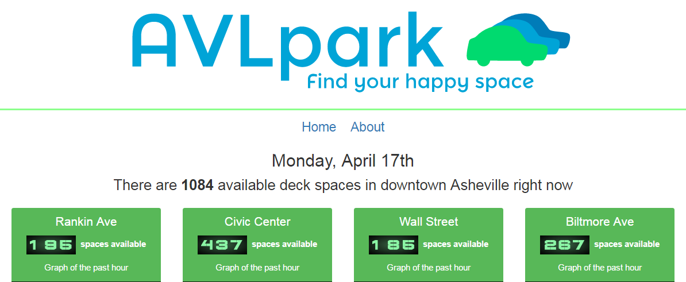

# Park Your Car With Open Data
### By Scott Barnwell

As we work to promote the open data program at the City of Asheville, we sometimes wonder if and how data sets are being used by the community once they are released. All too often, our metrics are limited to the number of data set downloads from Asheville’s [Open Data Portal](http://data.ashevillenc.gov/). Fortunately, our civic tech community will occasionally delight us with an app powered with open data.

That is exactly what happened when a local web development shop, [PRC Apps](https://www.prcapps.com/), built [AVL Park](http://avlpark.com/). We had just released an [open data feed](https://s3.amazonaws.com/asheville-parking-decks/spaces.json) with counts of available parking spaces in each of four city parking garages, updated on a 10-second interval. Tapping into this feed, PRC Apps designed a dashboard to deliver the data to the public. They then took it a step further, using [Keen.io](http://keen.io/) to log historical parking count data to help inform future debates on the need for more parking and where it should be located.

It is helpful to track the number of downloads from the Open Data Portal as a simple metric of the portal’s use. However, being delighted by citizen-designed apps powered by open data is the best reward we could hope for.

Originally published April 18, 2017

Tags: CIVIC TECH, COLLABORATION, OPEN COLLABORATION, OPEN DATA
