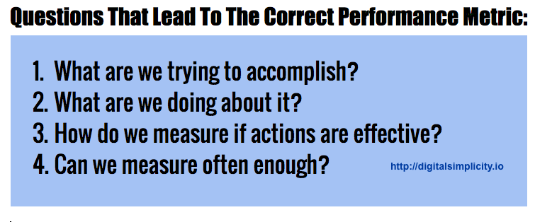

# Performance Metrics, Simplified
### By Jonathan Feldman

We’ve been using a simple and Socratic method of arriving at performance metrics that seems to have worked out well. Please let us know what you think — tweet it if you like it. 🙂

–JF

## Questions That Lead to the Correct Performance Metric
1. What are we trying to accomplish?
1. What are we doing about it?
1. How do we measure if actions are effective?
1. Can we measure often enough?

Originally published March 7, 2017

Tags: change management, civic, IT, dashboards, reporting