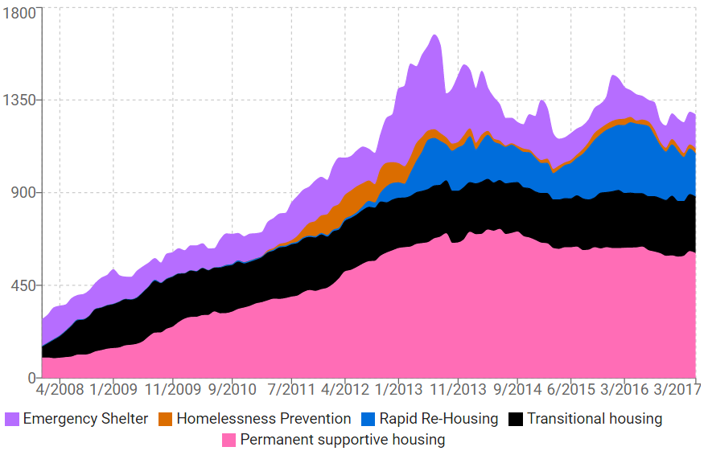

# Pretty Graphs Are Not Enough: Doing Dashboards Differently
### By Eric Jackson

We are learning some valuable lessons in designing public dashboards. Here are a couple from our work on the [new homelessness dashboard](http://dashboards.ashevillenc.gov/homelessness), which we are soft-launching today for feedback from stakeholders.

**Dashboards are a process, not a destination**

Dashboards are ubiquitous in civic tech. It seems like every vendor out there now boasts a set of dashboards that will solve all your public information problems at the touch of a button.

Sorry, but it just ain’t so.

Our view is that every launch of open data or data-centric reporting initiates a conversation. In effect, we use the launch as a proposal and then invite stakeholders to engage to help us improve it. That process never ends for as long as the data are relevant to the public conversation.

Today’s launch continues a conversation that is already taking place in our community with the goal of informing it and making it more constructive. We expect the dashboard to evolve as we learn from key stakeholders and then from the community at large what works and what doesn’t, what we might be missing, and what new questions we need to tackle.

**There are limits to what we can know**

Most of the data that feeds the homelessness dashboard comes from our [Homeless Management Information System](https://en.wikipedia.org/wiki/Homeless_Management_Information_Systems) (HMIS), which houses client-level data on homeless populations served in our community. Access to HMIS data is strictly regulated to to ensure that it cannot be used to harm or take advantage of participants in the programs. While HMIS is restricted by regulation, those regulations provide important protections that we need to provide proactively in all cases for sensitive data and for data affecting vulnerable populations.

There has been spirited discussion recently in Asheville about arrests potentially targeting homeless individuals. As a result, there is strong interest in investigating the detailed connections between arrest and homeless data to illuminate the discussion. This is something we simply are not permitted to do under HMIS regulations. Federal regulations strictly prohibit disclosure of any client-level data – only aggregate data can be extracted, and even then only with great care.

Such limits on data access can make it difficult or even impossible to answer some questions.This doesn’t mean that we should avoid them. The hard questions are often the most important questions. The lack of hard data may just require more creative collaboration among stakeholders.

This takeaway isn’t limited to just our homelessness dashboard — it’s a key understanding about dashboards in general. The purpose of a dashboard isn’t to sling out some eye candy that is void of nuance. *The purpose of a dashboard is to illuminate an important conversation.* For that conversation to work, participants must come to a mutual understanding of the data available, how it can or can’t be used and interpreted, and what context is needed for particular issues.

This is THE critical part of productive data-driven conversation and decision-making, whether in a community, a company, or anywhere else.

This post was a joint effort by Eric Jackson, Frances Ruiz and Jonathan Feldman.

Originally published July 20, 2017

Tags: CIVIC ENGAGEMENT, DASHBOARDS, OPEN DATA
