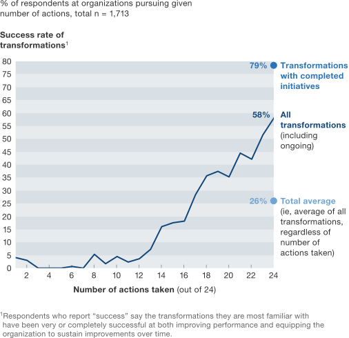

# Public Thinking? Civic IT Doesn't DO That
### By Jonathan Feldman

This won’t be the first time my colleagues look at me like I’m stark raving mad. It has happened before. It happened when Asheville’s IT staff put together a cloud computing community event in 2011; it happened when we published an open data catalog in 2012; and it may happen again when my colleagues in other municipal governments realize that my civic IT staff and I have launched a blog to document our civic IT aspirations, plans, achievements, and failures.

I can hear it now: Jonathan, what on earth are you DOING? Civic IT doesn’t _do_ that!

Yes, it does. Let me explain.

##Destination Digital

First, where are we, as a department, trying to go? How are we trying to change the conversation, and thus the direction and actions of our organization?

The key is relevancy — to municipal IT and to municipal IT customers.

It’s pretty obvious to anyone paying attention that IT, in general, as we know it is either dead or on serious life support. Anybody who actually gives a flip about IT being relevant is doing some serious thinking about how IT can be relevant in a world where all an employee needs is a credit card and an idea to be able bypass IT and deploy digital services.

And yet.

The right _kind_ of IT organization is in a position to contribute to the health of the overall organization in ways that were never before possible. At most organizations, the IT function can co-create what the pundits are calling “Digital Transformation”. Note that I say “co-create”, not “create.” IT can’t do it alone.

But what the heck is “digital transformation?” A practical definition is in order (from my [InformationWeek column](https://www.informationweek.com/government/leadership/usability-the-road-to-digital-transformation/a/d-id/1320712), where I have thought these matters through before): Digital transformation is (loosely) the ability to take your organization and apply modern tech and processes to achieve business goals in a way that was never before possible. That is, digital should help your organization engage better with customers. Digital should and must focus on increasing customer delight and simultaneously helping the organization to serve the customer more easily and in a more automated manner.

The result for private business: more and less costly “conversion”, the polite word for getting the customer to do what the business wants, in many cases, spend money.

The result for government: the ability to delight (yes, delight) residents, and to serve them and partner with them more efficiently and at less cost than ever by persuading them to use those delightful and efficient online systems instead of doing the equivalent of driving somewhere and waiting in line at the DMV.

Our efforts with digital have paid off big time, not only with national awards (which is nice, I admit), but with residents and business owners, which is what counts.

We’ve delighted with the Asheville App (take a photo, get your problem solved without having to talk to a call center), as well as with SimpliCity, a tool that dramatically simplifies access to frequently requested city data. Both Simplicity and Asheville App have garnered praise from residents and business owners alike, with comments like this landing in my inbox: “Thank you! I am no longer intimidated by online information!”

If you’re a good actor in government, how could digital be a bad thing?

## Transparency’s Success Story

I promise, I’m getting to the blog part. But before we get there, let’s take a look at what others have said about organizational transformation. After all, digital transformation is just one way of changing an organization.

My friend, colleague, and digital luminary [Dion Hinchcliffe](https://dionhinchcliffe.com/) recently [tweeted out a study by McKinsey](https://mobile.twitter.com/i/web/status/789141015609442304), saying, “Of all the actions for change you can take, communication is most closely linked with success.”

Well, if you’re a practitioner of organizational change, this is not news. But it’s helpful to have McKinsey backing this claim with data:

>Good communication has an even greater effect at enterprise-wide transformations, where company-wide change efforts are 12.4 times more likely to be successful when senior managers communicate continually.

Not 2 times. Not 5 times as likely. But over 12 times more likely. How is this possible?

## Communication + Accountability = Credibility

The McKinsey study says that more action is positively correlated with the success of the initative.

>When organizations follow a rigorous approach to transformation and take more actions, the overall success rate improves dramatically

I’m a practitioner, not a management consultant. But I agree 100% with the McKinsey findings. Over my last two decades of turning public and private internal IT and professional IT services organizations around, I have found that communication and accountability are the key factors towards building credibility. And credibility is the thing — the only thing — that allows you to successfully execute on actions in the larger organization.

Think about it. Do you allow someone who isn’t credible to do anything risky? Of course not. Yet, IT, HR, Finance, and other internal service organizations routinely demand the organization to trust them, without doing what it takes to first build credibility and earn that trust.

Our quarterly and annual reporting at the City of Asheville during my tenure have allowed us to show what we have done; admit our mistakes; expose what we have done about our mistakes; and above all, to show how our customer, whether internal or external, is front, center, and above all else our priority.

The admission of mistakes is key to credibility: If you don’t publicly admit when things go wrong, expect _nobody_ to believe you when you publicly say things have gone right.

Right? We all know of Pollyanna organizations — both government and private sector — where everything is sunshine and roses and unicorns and rainbows, all the time. That’s a great way to get people to disengage, which equates to a great way to completely disable organizational change: management must be credible before employees engage.

The way to credibility and change: Fess up when you mess up.

## Public Thinking, Open Collaboration

The top types of communication that any organization seeking change can do is to both disclose plans in advance and then report out results. “Are we moving the needle?” “Did we do what we said we did?” This is also part of the oil of credibility.

But communication isn’t just about reporting out results. Sometimes it’s about publicly thinking about plans before they’re solidified. The open marketplace of ideas is alive, well, and beneficial; I have personally benefitted from more than 20 years of public thinking in the pages of magazines and websites like InformationWeek.

The cycle goes like this: a public thinker has an idea, and realizes that it needs at least some polishing before it gets widely read. As opposed to an internal document, the level of potential public scrutiny means that the writer or speaker puts much more effort and polish into it. It means that the creator anticipates tough questions about what is being said. “What if someone says XYZ? What then?” Anticipating wide criticism usually results in a better product.

But, as opposed to an internal document, the cycle isn’t over. Now, people who don’t report to you and have no vested internal political relationship interest get to react to what has been communicated. Maybe your premise was flawed. Maybe you don’t fully understand what reality is on the ground. There’s a _huge_ amount of learning that happens during this part.

Moreover, thinkers like [Vala Afshar](https://twitter.com/valaafshar) have pointed out that when leaders engage publicly on platforms like Twitter, they are “[inspiring technology and business leaders to actively drive digital transformation for the betterment of their employees, customers and business partners.](https://www.huffingtonpost.com/vala-afshar/2016-top-100-most-social-_b_9765538.html)” Right on!

Around here, we think of everyone as a leader. So, we got to thinking: why limit this practice to the CIO? Why not have other practitioners weigh in and do their own public thinking, which leads to public and open collaboration?

Thus, this blog. Digital, because digital is the goal. Simplicity, because we both believe in and succeed with simplicity as a design principle.

And while the blog is still in its infancy, I am really encouraged by what I’ve seen so far from employees.

Take a look at Asheville systems analyst Christen McNamara’s post about [letting our customers teach us what simplicity means](./letting-customers-teach-us-simple-means.md). Her “Field Trip Friday” approach to designing apps and her adoption of the “Build WITH, Not For” mentality is honest and a refreshing change of pace from same-old-same-old IT.

Or, check out Asheville digital services architect Eric Jackson’s “[Shared Data, Shared Systems](./shared-data-shared-systems-getting-everyone-page.md)” post, where he lays out our Big Hairy Audacious Goal to re-imagine and re-architect the City’s information delivery systems, not as a wonkish pile of middleware, but as a digital services infrastructure that supports business goals. We anticipate simplifying the creation of business performance metrics and creating more self-service transparency, among other awesome goals. Eric will be sharing even more about this soon; I’ve gotten a preview, and I can’t wait.

Over the next weeks and months, we’ll share more plans, report-outs, and maybe even a mini-disaster or two. We’ve even got plans to invite other civic and not-for-profit organizations interested in digital transformation to contribute to this blog.

If you’re interested in being added to our notification list when new posts go out, OR if you’re interested in joining the fun and contributing, please email me at jfeldman@ashevillenc.gov, with a subject of “#digital” (which will make sure that I see it). Thank you for your support!

—Jonathan Feldman, Chief Information Officer, City of Asheville, NC

Originally published September 22, 2016.

Tags: GIS, Lean Government, User-Centered Design
