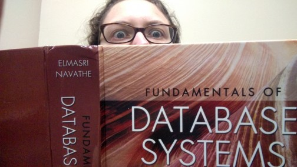

# Good Tech Skills Assessments Aren’t Sneaky, They’re Clear, Realistic & Respectful
### By Frances Ruiz

* We recently conducted an exit interview with Cameron Carlyle to learn what we could from him about his experience and ways to improve IT Services. We realized that it’s just as valuable to learn from someone just starting while they still have new eyes. In that spirit, the first of two “entrance interviews” with Frances Ruiz, Cameron’s replacement. Regarding our interview process, check out [our earlier post](./exit-interview-cameron.md). – The Editors *

## What did you think about the skills assessment?
I have interviewed for several technical jobs and the skills assessments have ranged from a simple 15 minute paper-and-pencil database exercise, to a 30-question written questionnaire, to live coding of a solution to a “sneaky” puzzle while several interviewers looked over my shoulder and asked me questions meant to confuse and disorient me.

What I liked about the City of Asheville’s skills assessment was the following:
1. It was a more realistic imitation of what I’d be doing on the job every day on the job than the approaches I mentioned above
1. It allowed me to demonstrate what I could do beyond what was on my resume
1. It let me feel more relaxed in the in-person interviews because I knew the interviewers had already looked at my code and liked what they saw

The City of Asheville’s assessment gave me a chance to demonstrate my problem solving abilities and my productivity. I had never used React in my former work, but the skills assessment mentioned that SimpliCity was being redesigned using React. So I decided to complete the assessment in React. I then decided to focus on just two of the three assessment areas and demo only a few sample pages. With a clear and targeted focus I knew I could fit the assessment work into my busy schedule over a few days.

My approach demonstrated that I am not intimidated by new technologies, that I can quickly learn to use them, and that I can manage my time effectively and prioritize to get something useful done in a short turnaround time. I believe it would have been much harder, if not impossible, to demonstrate all of those qualities without the skills assessment.

What I think made the City of Asheville’s skills assessment so successful:
1. It was well-thought-out and relevant to the position’s direct responsibilities
1. It was respectful of the candidates’ time – an appropriate and realistic scope for a day or two of work
1. They didn’t ask everyone to complete it

In my past job searches I’ve encountered several companies who create frankly ridiculous assessments, such as “create a full project proposal for our new initiative”, “write a grant for this project”, or “create a polished web app to do X”. Such companies are requesting candidates to work for free for perhaps 40 hours or more, and then they potentially benefit from the work done by candidates that they do not actually hire. As a result of seeing unfair assessments in the past, I was initially wary upon hearing there was a skills assessment for the City of Asheville, but after I read the description it seemed quite reasonable so I decided to participate.

I also appreciated how the City of Asheville only asked some candidates to complete the assessment, so they did take some care to narrow the pool before asking for the time investment from the candidates. When you know thirty other people might be completing an assessment too, it is harder to take it seriously. In this case, I knew there were only three or four others participating, so I felt that I had a fair shot.

## What did you think we did well?

Outside of the assessment, I appreciated the clear timeline for the interview process. I received frequent communications from Scott Barnwell, the hiring manager, about where the City was in the overall process and when final decisions could be expected. I also enjoyed getting to speak with several members of the team and receive a really good picture of the culture, work environment, and types of projects I would be working on in advance.

## What do you think we could improve?

The only suggestion for improvement I would make would be to provide a suggested time limit for the skills assessment to give candidates more of an idea of how much they should really put into it. While we were told we were not expected to have a polished or complete project, there was no ballpark figure such as “we expect most candidates to spend around 6 hours on this assessment”. I think such a general guideline would have been helpful.

* Coming up: the first weeks after being hired. *

Originally posted April 4, 2017

Tags: IT SERVICES, IT STAFF
