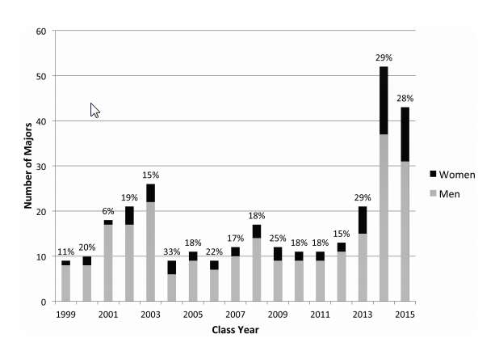
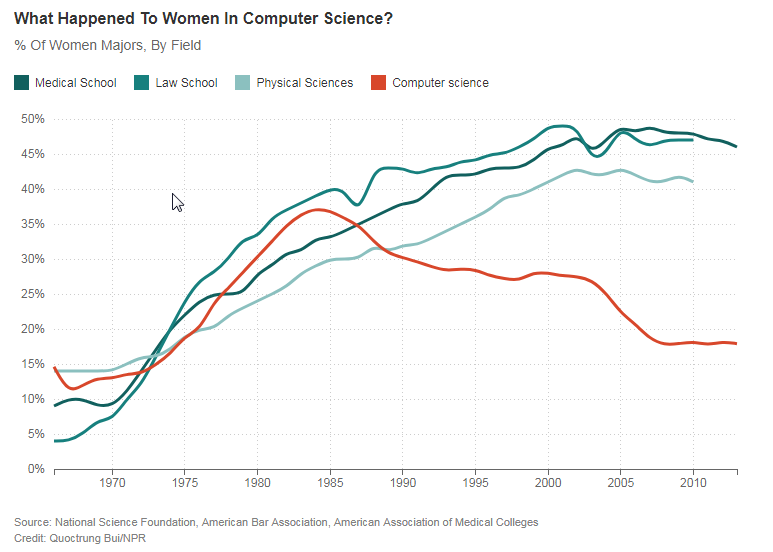

# Maybe Women Just Don’t Like Computers
### By Frances Ruiz

As a result of the recent [Google memo](https://en.wikipedia.org/wiki/Google%27s_Ideological_Echo_Chamber) debacle, my Facebook feed has been on fire this past week with heated debates about gender diversity in tech. One statement that popped up in my feed multiple times really riles me up:

**“Maybe women just don’t like computers.”**

Why does this statement get my blood boiling? Shouldn’t we be open to the idea that biological differences might in fact steer men and women towards different life paths?

Sure. If biological differences were really all there was to it, saying “Maybe women just don’t like computers” wouldn’t be so controversial. But we are working with an equation that has many parts. Biological differences may be a potentially valid part, but they are miniscule in comparison to the other influences.

When someone says “Maybe women just don’t like computers”, they are ignoring the huge societal barriers that I have experienced personally and that I have heard described time and time again by my female colleagues.

From an early age we receive messages telling us that certain fields are “for us” or “not for us”. Over time, we internalize these messages and through a vicious feedback loop we end up “liking” or “disliking” what we are expected to.

**“Well if they were actually interested, they would have tried it on their own. Anyone with a genuine talent or interest in computing wouldn’t let ANYTHING stand in their way”**

Really? Let’s pick that one apart for a minute.

When I was a child, my parents bought my brother a top-of-the-line, deluxe Lego set…and they got me Barbies. As a result, my brother got hours and hours of practice developing his spatial skills, and I got to change Barbie’s and Ken’s outfits over and over again.

I would beg my brother to let me play with his legos, but he would just toss me five of his “reject” pieces, which I would forlornly push around whilst watching him build McMansions for his lego men which included wires threaded through the walls to fireplaces that actually lit up.

My parents thought my brother would “share” his legos. But they were still “his” to share. I learned that “Legos are for boys. Barbies are for girls”.

By extension, that grows into “STEM is for boys. Arts are for girls”.

Why go out of your way to try something that isn’t for you? Why would it even occur to you?

**It’s never too late to get interested**

The spark many women initially feel as children for legos, trucks, building blocks, or anything else “boy” often dies a death by a thousand cuts long before they graduate high school. By the time you get to college then, it’s no wonder many CS classes have a “token” girl at most.

But I found in my work as academic support coordinator for computer science at Swarthmore college, that it isn’t too late to attract new groups to the field.

Swarthmore made conscious efforts to revise their introductory computer science course content to be interesting to computer “newbies”. They also implemented a peer mentorship program which provided support for all students, which I coordinated as part of my role. We wrote about our success at Swarthmore [in this paper](https://www.cs.swarthmore.edu/~newhall/papers/sigcse14.pdf).

Check out this graph from the paper, which shows how these actions affected Swarthmore’s percentage of female computer science majors:

**Multi-talented women will pursue something else if they don’t feel welcome**

When I worked at Swarthmore, I found myself wishing almost daily that the college I had attended had been more like it.

When I was a freshman in Carnegie Mellon’s computer science department, I didn’t feel welcome. And despite the program’s making extra efforts to recruit women, once we got there we were dropping like flies. Why? Because we didn’t fit the “mold” that we felt we were supposed to fit into.

Each school at the college had their own nickname. The School of Computer Science (SCS), was known as “Still can’t shower”.

As a young freshman, I had many passions, so why take the “hard” path and stay in Computer Science, when I could take the “easy” path of majoring in Creative Writing which I enjoyed just as much? (and actually more at the time, since the intro to programming class I was in was SOOOO boring it gave me the entirely wrong impression of what computer programming is like).

So I jumped ship and went to the school of Humanities and Social Sciences, known as “H and less stress”. And if I’d been able to find a job that paid the bills in Creative Writing when I graduated in 2005, I never would have looked back. But since I wasn’t lucky enough to be the next J.K. Rowling, I taught myself computer programming and software development on my own and was lucky enough to break into the field without much trouble.

**We don’t even know this history of our own field**

Statements about women not liking computers become laughable when you learn about how integral women were to the field in the first place. I for one had never even heard of Grace Hopper until I worked at Swarthmore and we took a group of students to the Grace Hopper Celebration of Women in Computing…which is embarrassing to admit. I was surprised to learn about how the first programmers were mostly women. I also only relatively recently learned that women weren’t always so few in college programs in CS. Their numbers were rising steadily alongside medical and science degrees until 1984, when they suddenly took a nosedive (from “[When Women Stopped Coding](http://www.npr.org/sections/money/2014/10/21/357629765/when-women-stopped-coding)” on NPR’s Planet Money):

If women suddenly stopped liking computers in 1984, then of course it must all be biology *eyeroll*.

**Not liking computers and not liking a toxic work environment are two very different things**

Lastly, just like my college freshman self was pushed away, many female software engineers are pushed away by the culture of the companies they land in. I am one of the lucky ones who works in an environment where you’d be hard-pressed to find even a hint of disrespect towards any gender or ethnic group.

But, as recent fiascos at places like Uber and Google have shown, my experience is more the exception than the rule. We must not ignore the “brogrammer” problem that drives many women away.

Blaming women for just “not liking computers” is a major cop out. We can do better.

Originally published August 15, 2017

Tags: BROGRAMMER, CULTURE, GENDER DIVERSITY, GOOGLE MANIFESTO, TOXIC WORK ENVIRONMENT, WOMEN IN COMPUTING, WOMEN IN TECH
